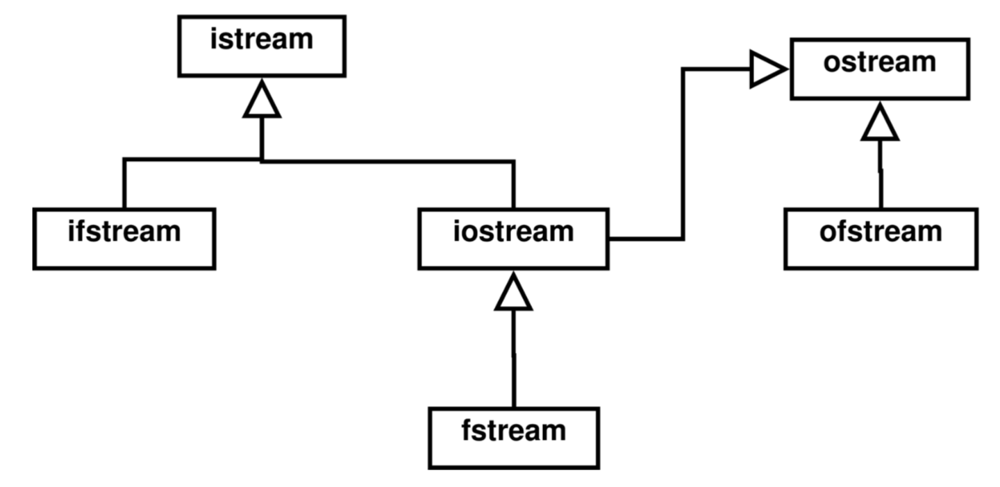

# COMP-2404

📘 My notes for my Intro into Software Eng. (CS) course – written in markdown

# 1.1 | Basics of C++ Development

## Shells
A shell is program that allows direct access to OS, and allows users to run programs.
- command line interpreter
- main shells
  - ksh (korn shell)
  - sh (bourn shell)
  - bash (bourne-again shell)
  - csh (c-shell)
- differences include
  - commandline shortcuts
  - environment variables

## Redirection
pipelining is used for io redirection
- \< redirects from
- \> redirects to

## Program Building

**Compiling:** generate object code from source files<>
- gcc -c to compile.

**Linking:** generate executable from object code
- gcc -o to generate executable.

**Makefiles:** easy way to compile and link multiple source files.
- text file
- organizes compiling and linking commands
- defines source file dependencies

## 1.2 | Basic Language Features

**Expressions:** sequence of operation that evaluates to a single variable.

**Statements:** expression terminated by a semicolon that resolves to a single variable.

**Blocks:** sequence of statements within pair of braces.

**Scope:** part of program where a variable can be used.

### Operators
- **operands**
  - variables on which operator acts on
- **arity**
  - number of operands / arguments
- **precedence**
  - order in which operators execute
- **associativity**
  - order in which operators of same precedence execute
    - right-to-left / left-to-right

### Variables
- contains: name / value / data-type / memory address
- can be primitive / user-defined / pointer

### Functions
- **global / member functions**
  - static member functions are like 'global' within class
- **declaration / implementation**
  - declaration in header
  - implementation in source
- **function design**
  - reusable
  - single purpose
  - encapsulation (hidden functionality)

## 1.3 | Programming Conventions

### Naming / Indentation / Comments
- promotes readability
- comments block in main
  - specifying purpose of program
  - usage (command line arguments)
  - author
  - revisions
- comments before class
  - specifying purpose of class
  - descriptions of complex / critical members

# 2.1 | Classes

## Binary Scope Resolution Operator ::
1. To access a global variable when there is a local variable with same name.
2. To define a function in source file.
3. To access a class's static variables.
4. Multiple inheritance.

## Access Specifiers
- public
  - visible to all
- private
  - visible only to same class
- protected
  - only visible to sub-classes

## Code Organization
**header Files:**
- class definition
- data members
- member function prototypes

**Source Files:**
- member function implementations
- static data member initialization

## Class Interface
- how you interact with a class
- shows the set of **public members**
  - what users need to know:
    - class name
    - public members

# 2.2 | Constructors + Destructors

## Default Arguments
- default parameter value
- specified in function prototype
- must be right-most in parameter list

### Constructors
- explicitly called
- three types

**1. Copy Constructor:**
- takes a reference of the same class
- called when you initialize a variable to another object
  - but not already initialized variable
- implicitly called when you pass by reference

```c++
Date d1, s2;
Date d3 = d1; // implicit call to copy constructor
d3 = d2;      // will call assignment operator
Date d4(d1);  // explicit call to copy constructor
```

**2. Conversion Constructor:**
- takes any reference of other than same class

**3. Default Constructor:**
- called when memory is allocated statically / dynamically
- initializes data members

### Destructors
- implicitly called
- order of execution
  - child destructors are executed before parent

# 2.3 | Memory Management

## Pointers

- small, fixed-size variable
  - allows changes to memory outside current scope
  - avoids copying data
  - the only way of using dynamically allocated memory

- **operators:**
  - arrow (->) / dereferencing (*) / address-of (&)
  - dot operator (.) accesses object members
  - arrow operator (->) dereferences object and then accesses object member

## Dynamic Memory Allocation
- use `new` / `delete` commands

## 4 types of arrays
- **statically** allocated array of **object pointers**
- **statically** allocated array of **objects**
- **dynamically** allocated array of **object pointers**
- **dynamically** allocated array of **objects**

# 3.1 | Basics of Object-Oriented Design

- **Software Development Life Cycle**
  - requirements analysis
  - design
  - implementation
  - testing

# 3.2 | Information Hiding

**Single Responsibility:** objects should have only one purpose.

**Data Abstraction:** separating class definition from implementation.
  - separate the **what** from the **how**

**Encapsulation:** group data that belongs together.
- protect data from bad code
- reuse code when possible
- give data members only private or protected access

**Principle of Least Privilege:**
- protect your data
- access to runtime objects should limited

# 3.3 | Object Design Categories

## Types of Objects

- **control**
  - control program flow
  - manages how classes interact
- **view (boundary)**
  - communication /interaction with user
- **entity**
  - persistent information
  - information that survives termination
- **collection**
  - *collection:* data structure to store multiple data objects of same type
  - collection class stores multiple collection objects

# 3.4 | Documenting Design

**UML Class Diagrams:**
- no collection classes
  - implied with multiplicity
- no getters / setters / ctor / dtor
- include **classes:**
  - attributes / operations
- include **associations:**
  - composition / inheritance
- include **composition:**
  - directionality / multiplicity
- include access specifiers
  - `+` public
  - `#` protected
  - `-` private

# 4.1 | Essential Techniques

## Composition
- member initializer syntax
- order of ctor / dtor

## Constants
- objects / data members / member functions
  - object / data member: constant keyword before data type
  - member function : constant keyword after prototype
- constant functions
  - cannot modify data members
  - the only type of functions allowed on a constant object
- constant data members must be initialized before constructor body
- must use member initializer syntax

## Friendship
- grants access to all private / protected members
  - cannot be taken
  - does not apply to derived classes of friend class
- friend function can access all members of a class

## Static Class Members
- exists even without class instances
- global to class
- only one instance allows
- initialized in constructor
- static member functions can only access static data members

## Linked Lists
- insertion / deletion / clean-up
- singly / doubly / tail / no-tail

# 4.2 | Inheritance

## base / derived
- all base class members are inherited
  - but access modifiers change
  - private become invisible
  - protected / public remain the same

## base class initializer syntax
- call base constructor as with class initializer syntax

## Types of Inheritance
_Virtual inheritance is a C++ technique that ensures only one copy of a base class's member variables are inherited by grandchild derived classes._

# 4.3 | Design Patterns

## order of execution
  - ctor / dtor
  - ctor: parent to child
  - dtor: child to parent

# 4.4 | Polymorphism

- enables generalized use of a class hierarchy
  - interface at base class
  - derived classes override interface functions with specialized behaviour
- use base class pointers to manipulate derived classes
  - this is called **dynamic binding**

## Function Bindings
Linking a function call to a specific function

- decide between derived and base class member functions

### Static Binding
- selection made at compile time
- _always used_ when called using **object variable** name
- _can be used_ when called using **object pointer**

### Dynamic Binding
- selection made at runtime
- _never used_ with **object variable**
- _can be used_ with **object pointer**

# 4.5 | Overloading

Giving multiple meanings or definitions

## Function Overloading
Overloaded functions have same name
- but different parameters

Convention is that overloading is used for _functionally_ related tasks.

## Operator Overloading

Overloading operators allows for:
- language consistency
- code readability
- because it's cool

Implicitly overloaded operators (provided by compiler)
- assignment `=`
- address-of `&`
- sequencing `,`

```c++
/// header file ///
class Time {
    bool operator<(Time&);
};

/// source file ///
bool Time::operator<(Time& t) {
    return convertToSecs() < t.convertToSecs();
}
```

## Dynamic Allocation
If you have an object with dynamically allocated members, you should provide:
- copy constructor
- destructor
- overloaded assignment operator

`// dynamic allocation is when you allocate memory from the heap (using keyword: new)`

## Approach
- Operators can be overloaded globally or as a member function.
  - but not both.
  - cannot be static member function
- operators for primitives cannot be overloaded
- no new operators can be created
- arity cannot be changed
  - (number of operands / arguments)
- precedence or associativity cannot be changed
- `.` / `::` / `?`/ etc operators cannot be overloaded
  - certain operators are non-overloadable

## Cascading
Chaining together member function calls in a single statement.
- member functions return pointer to current object
  - return `this`

```c++
date.setDate(day, month, year).toStr();

/// cascading member function
Date& Date::setDate(int day, int month, int year) {
    setDay(day);
    setMonth(month);
    setYear(year);

    return *this;
}
```

## Operators as Functions
Some operators **must** be overloaded as **member functions**.
- `()` cast
- `[]` subscript
- `->` arrow

Some operators **must** be overloaded as **global functions**.
- `<<` stream insertion
- `>>` stream extraction
- etc (to enable commutativity)

## Stream Operators
Stream insertion operator `<<` takes two operands.
- left-hand side: `cout`
  - `cout` is an `ostream` objects
  - used as a reference
- right-hand side: object (to be output)
- must be a friend function to output class

```c++
/// header file ///

class Time {
  friend ostream& operator<<(ostream&, Time&);
  friend istream& operator>>(istream&, Time&);
  
  // code...
};

/// source file ///

/// global overloading of `>>`
istream& operator>>(istream& in, Time& t) {
    int h, m, s;
    in >> setw(2) >> h;
    in.ignore();
    in >> setw(2) >> m;
    in.ignore();
    in >> setw(2) >> s;
    t.setTime(h,m,s);

    return in; // return the input stream object
}

/// global overloading of `<<`
ostream& operator<<(ostream& out, Time& t) {
    out << setfill('0') << setw(2) << t.hours   << ":"
        << setfill('0') << setw(2) << t.minutes << ":"
        << setfill('0') << setw(2) << t.seconds;

    return out; // return the output stream object
}

/// usage ///
Time t;
cin >> t;
// accepts three lines as input (h,m,s)
  // 12
  // 30
  // 45
cout << t << endl;
// prints `12:30:45`
```

## Unary Operators
- **Global:** one parameter
  - object (or reference)
- **Member:** no parameters
  - cannot be static

## Binary Operators
- **Global:** two parameters
  - first is target object (or reference)
- **Member:** one parameters
  - cannot be static

## Prefix / Postfix ++ / --
To differentiate from prefix and postfix version of an operator, a **dummy variable** is used.
- postfix ++ will use **copy constructor** to generate a temporary copy
  - returns local copy (**not** a reference)
  - so it will be slower than prefix

### Example: Member Functions
- **Prefix:** no parameters:
- **Postfix:** one parameter:
  - dummy variable

```c++
/// header file ///
class Time {
  public:
    Time& operator++();     // prefix  ++t
    Time  operator++(int);  // postfix t++
};

/// source file ///

/// prefix ++
Time& Time::operator++() {
    int tmp = this->convertToSecs() + 1;
    this->setTime(tmp);

    return *this;
}

/// postfix ++
Time Time::operator++(int) {
    Time tmp = *this;
    ++(*this);

    return tmp;
}
```

### Example: Global Functions
- **Prefix:** one parameter:
  - reference to target object
- **Postfix:** two parameters:
  - reference to target object
  - dummy variable

```c++
Time& operator++(Time&);        // prefix  ++b
Time  operator++(Time&, int);   // postfix b++
```

# 4.6 | Templates

## Overview
Templates are used for data-abstraction.
- separating _abstract_ properties from _concrete_ implementations
Improves code reusability.
- use generic datatypes

## Function Templates
_Note: you can overload templated function with non-templated function._

When code is compiled, the compiler will generate the **specialization** of the template function.
- each **specialization** will have datatype hardcoded
- but only for datatypes used.

```c++
template <typename T>
T max(T v1, T v2, T v3) {
    T maxValue = v1;
    if (v2 > maxValue) maxValue = v2;
    if (v3 > maxValue) maxValue = v3;

    return maxValue;
}
```

## Class Templates
If you have a templated class
- source file implementation is moved to header file

```c++
/// header file ///
template <class T>
class Array {
   template <typename V>

    public:
      Array<T>& operator=(Array&);
};

/// implementation (header file) ///
template <class T>
Array<T>& Array<T>::operator=(Array<T>& arr) {
    if (&arr == this) return *this;
  
    if (capacity != arr.capacity) {
        delete [] elements;
        capacity = arr.capacity;
        elements = new T[capacity];
    }

    for (int i = 0; i < capacity; ++i)
        elements[i] = arr[i];

    return *this;
}
```

# 4.7 | Exception Handling
Faults are bound to happen when programming.
- thus error handling is critical
- find the errors before the user does...

Fault tolerance is the ability of a program to keep running.
- even in the presence of errors
  - error checking
    - Ensure correct inputs, etc.
  - exception handling
    - How to recover from failures

## Error Handling
In order to improve readability:
- seperate **error reporting** from **error handling**
  - finding and fixing errors occur in _different places_

## C++ `exception` Class
Base class for **user-defined exception classes**
- string parameter in constructor for error message
- member function `what()` returns error message string

```c++
try {
    if (den == 0)
        throw "Divided by zero !!!"; // throw error with message
    result = num / den;
}
catch(const char* error) {
    cout << error << endl;
}
```

If an exception is uncaught, the program will terminate.

## Stack Unwinding
Since uncaught exceptions terminate their scope
- local variables are lost
- memory is not deallocated
- program may be in an inconsistent state

### Best Approach
Make everything an object with destructors that care of clean up
- destructors automatically called

# 5.1 | Standard Template Library

# 5.2 | Files + Streams

## Stream
A stream is a sequence of bytes.
- contain a set of error bits
  - `good`: if high -> no errors
  - `fail`: if high -> formatting error
  - `bad`: if high -> unrecoverable error
- contains `eof` bit -> end of file reached

### Characteristics of Streams
- overloaded `!` operator
  - returns true if one of the error bits is high
- cast to `void*` operator
  - implicitly called when stream is tested as a condition
  - converts stream to a pointer
    - `null` if any error bit high

### Input Streams
- formatted data: `>>`
  - stream extraction operator
- unformatted data: `get().getline()`
  - member functions
- EOF (end-of-file)
  - tested using eof()

## Files
A file is stream in a persistent state
- in non-volatile storage

### Characteristics of Files
- linear array of bytes
- terminated by EOF
- represented as objects

## `iostream` Library
istream: `cin`
- input stream

ostream: `cout` / `cerr` / `clog`
- output stream

iftream: `cin`
- input file stream
- derived from istream

oftream: `cout` / `cerr` / `clog`
- output file stream
- derived from ostream



### `ofstream` / `ifstream`
constructor:
- can optionally open file
- second parameter indicates mode

### `ofstream` / `ifstream` Characteristics
- they maintain a file buffer object
  - the file buffer destructor closes the file
- can be tested for errors or EOF
  - using `!` or `(void*)` operators
- ofstream:
  - `<<` / `put` / `flush`
- ifstream:
  - `>>` / `get` / `getline`

## Stream Member Functions
- good() -> returns true if none of the below are true
- fail() -> returns true if `fail` bit high
- bad() -> returns true if `bad` bit high
- eof() -> returns true if `eof` bit is high
- clear() -> clears error and `eof` bits

# 5.3 | C++11